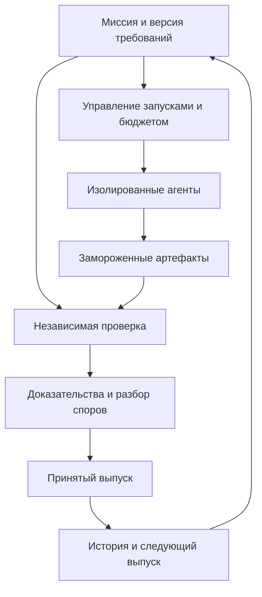

# От арены LLM к испытаниям живых продуктов

Исследование рынка и проект продукта · 17 сентября 2026 · версия 0.1

**Решение:** строить платформу, где команды со своими агентами создают и развивают небольшие продукты через несколько выпусков, а результат подтверждается пользовательскими сценариями и независимыми проверками. Публичная лига привлекает участников; повторяемые испытания и история пригодности продукта дают основание возвращаться и платить.

**Рабочее имя — FORGE.** Это обозначение проекта, без проверки бренда и домена. Первый коммерческий сегмент для проверки — команды API/SDK и инструментов разработки, которым нужно понимать, способны ли разные агенты успешно строить и поддерживать интеграции с их продуктом. Готовность этого сегмента платить пока не доказана.

Документ содержит кабинетное исследование открытых первичных источников, публичных обсуждений и исследовательских работ. Продукты лично не тестировались, интервью и платные пилоты не проводились. Найденные возможности не означают отсутствие других конкурентов. Статусы относятся к доступной документации на дату исследования; закрытые дорожные карты неизвестны.

## 1. Что исследование меняет в исходной идее

Идея «нескольким агентам дают задание, платформа определяет победителя» понятна, но сама по себе уже не образует сильного отличия.

| Предположение | Что обнаружено | Решение для проекта |
|---|---|---|
| Достаточно сравнивать приложения целиком | Design Arena описывает генерацию и развёртывание веб-приложений, full-stack и мобильных проектов | Создание первой версии — только первый этап |
| Достаточно сравнивать агентов, а не модели | DPAI Arena и Harbor уже работают на уровне агентных систем и рабочих процессов | Нужен собственный сценарий использования результатов |
| Независимые тесты сделают арену уникальной | Уже существуют инфраструктура проверок, среды, валидаторы и продуктовые evals | Проверки — необходимая основа, но слабая самостоятельная защита |
| Достаточно добавить спецификацию | Kiro уже строит процесс вокруг требований, проектирования и задач | Ценность — в проверенной связи требования с результатом и последующими изменениями |
| Больше найденных проблем означает больше пользы | Сопровождение может захлебнуться даже качественными находками | Считать закрытые обязательства и нагрузку на владельца |
| Репутация — одно число в рейтинге | Производительность зависит от проекта, среды, бюджета и способа работы | Показывать профиль доказанных возможностей и границы применимости |

Основания: [Design Arena: agentic harness](https://www.designarena.ai/methodology/agentic-harness), [JetBrains: DPAI Arena](https://blog.jetbrains.com/blog/2025/10/28/introducing-developer-productivity-ai-arena-an-open-platform-for-ai-coding-agents-benchmarks/), [Harbor](https://github.com/harbor-framework/harbor), [Kiro Specs](https://kiro.dev/docs/specs/), [Daniel Stenberg: The pressure](https://daniel.haxx.se/blog/2026/05/26/the-pressure/).

## 2. Карта рынка: кто уже что строит

Здесь «есть» означает наличие публичного продукта, документации или репозитория, а не независимое подтверждение всех маркетинговых обещаний.

| Направление | Игроки и наблюдаемые возможности | Последствия для FORGE |
|---|---|---|
| Сравнение созданных приложений | [Design Arena](https://www.designarena.ai/methodology/agentic-harness): выполнение задания в среде, работающий результат, голосование. Есть [агентный рейтинг](https://www.designarena.ai/leaderboard/agents) и [Micro Evals](https://www.designarena.ai/evals) | Самый прямой конкурент первоначальной идеи. Утверждать, что другие сравнивают только текст, нельзя |
| Массовое сравнение предпочтений | [Arena Code](https://arena.ai/leaderboard/code): рейтинг WebDev на основе пользовательских сравнений | Голосование и публичная таблица сами по себе дают мало отличий |
| Инженерные рабочие процессы | [DPAI Arena](https://github.com/dpaia): бенчмарки агентной разработки; объявлена многотрековая архитектура | Реальные репозитории и несколько типов инженерных задач уже часть конкурентной повестки |
| Инфраструктура испытаний | [Harbor](https://github.com/harbor-framework/harbor), [подключение агентов](https://www.harborframework.com/docs/agents), [RewardKit](https://www.harborframework.com/docs/rewardkit) | Среды, адаптеры и проверки разумно переиспользовать. Свой универсальный движок не нужен для первого продукта |
| Среды для оценки и обучения | [Prime Intellect Lab](https://www.primeintellect.ai/blog/lab): объединение сред, hosted evals и post-training | Набор сценариев может быть активом, но рынок инфраструктуры обучения уже сформирован |
| Оценка развития существующего ПО | [SWE-EVO](https://arxiv.org/abs/2512.18470), [RoadmapBench](https://github.com/UniPat-AI/RoadmapBench): изменения через версии и длительные задачи | «Измеряем длинные задачи» тоже недостаточная новизна. Нужны владельцы, пользователи и повторное практическое использование |
| Обновляемые инженерные наборы | [SWE-rebench V2](https://huggingface.co/datasets/nebius/SWE-rebench-V2): многоязычные задачи из реальных изменений | Свежесть и качество задач требуют отдельной постоянной работы |
| Организация работы нескольких агентов | [Conductor](https://www.conductor.build/docs), [Vibe Kanban](https://github.com/BloopAI/vibe-kanban): рабочие пространства, изменения, просмотр и ревью | Ещё одна доска с параллельными агентами будет конкурировать с готовыми средствами разработки |
| Постоянно работающие агенты | [Cursor Automations](https://cursor.com/blog/automations): автоматические запуски рабочих процессов | Повод для оценки смещается от разового запуска к постоянной работе и изменениям |
| Контекст, навыки и улучшение качества | [Tessl](https://tessl.io/): реестр контекста, оценки до/после, сравнение model+harness на собственных задачах и стоимости | Частная оценка агентов и «слой доверия» тоже заняты. Это сильный смежный конкурент |
| История решений агента | [Entire](https://entire.io/blog/the-entire-cli-how-it-works-and-where-its-headed): checkpoints с контекстом сессий, связанным с Git | Сохранение истории имеет самостоятельную ценность. Не стоит изобретать новый Git |
| Разработка от требований | [Kiro](https://kiro.dev/docs/specs/feature-specs/): формализация требований, проектирование, задачи | Генератор PRD не станет достаточным продуктом |
| Проверка по сценариям | [StrongDM Software Factory](https://factory.strongdm.ai/): сценарии вне рабочей кодовой базы, имитации внешних систем | Важный инженерный пример независимой приёмки; заявление команды о своём процессе не доказывает универсальную автономность |
| Работа и денежные задания | [Algora](https://algora.io/): найм и контрактная работа вокруг разработчиков; [SWE-Lancer](https://arxiv.org/abs/2502.12115): оценка на исторических оплаченных задачах | Соревнование, репутация и деньги уже соединяются в соседних форматах. Экономика исторического датасета не равна доходам действующей арены |
| Документация для агентов | [Mintlify](https://www.mintlify.com/blog/agent-analytics): аналитика обращений агентов к документации; [Stripe](https://docs.stripe.com/skills): официальные skills и плагины для интеграций | Есть наблюдаемый сдвиг: поставщикам инструментов нужно обслуживать агента как пользователя |

Это не оценка размеров компаний или их выручки. Звёзды GitHub, голоса на HN и маркетинговые проценты не использованы как доказательство платёжеспособного спроса.

## 3. Что команды планируют — и что уже видно

| Команда | Публичное направление | Как трактовать |
|---|---|---|
| JetBrains / DPAI | В анонсе 28.10.2025: новые треки, универсальный CLI, намерение передать проект Linux Foundation | Это объявленные намерения. Завершение передачи и готовность всех треков этим исследованием не установлены |
| Entire | В техническом обзоре: командная видимость, поиск, аудит и ревью с исходного намерения | Направление подтверждено словами команды; [поздние публикации](https://entire.io/blog) показывают развитие захвата контекста и поиска. Не все пункты следует считать одинаково завершёнными |
| Prime Intellect | В запуске Lab 10.02.2026 соединены среды, оценка и обучение; описано дальнейшее расширение способов обучения | Подтверждён вектор замыкания обратной связи. Статус каждой обещанной функции отдельно не проверен |
| Cursor | Автоматически запускаемые агенты опубликованы как продукт | Это более сильный сигнал, чем абстрактное обещание «автономных разработчиков» |
| Design Arena | [Changelog](https://www.designarena.ai/changelog) показывает обновление состава моделей | Это свидетельство поддержки платформы, но не открытая стратегическая дорожная карта |
| Stage | В [обсуждении запуска](https://news.ycombinator.com/item?id=47796818) авторы обсуждают включение контекста задач в ревью | Подтверждён интерес команды, а не факт запуска интеграции |

Мой вывод из совокупности сигналов: борьба идёт за полный цикл работы агента — постановку, контекст, выполнение, проверку и последующее улучшение. Закрытые планы лабораторий из этих источников вывести нельзя.

## 4. Реальные боли: что говорят люди

Ниже пересказы, а не дословные цитаты. Обсуждения дают качественные сигналы; они не являются репрезентативным опросом.

| Наблюдение | Свидетельство и ограничение | Следствие для продукта |
|---|---|---|
| Для ревью нужен исходный запрос | На [HN в обсуждении Stage](https://news.ycombinator.com/item?id=47796818) участник указывает, что понять корректность изменения без связи с первоначальной задачей нельзя. Другие сомневаются в пользе ещё одного AI-слоя и готовности платить | Каждое заключение связано с конкретным требованием. Проверяем экономию времени, не только привлекательность отчёта |
| Проверку трудно остановить | Автор [обсуждения о stopping condition](https://www.reddit.com/r/ClaudeCode/comments/1w2ei4c/i_think_ai_code_review_has_a_stoppingcondition/) описывает бесконечные новые замечания и предлагает заранее определить достаточные доказательства | У миссии есть критерии приёмки и граница: блокирующий дефект либо улучшение на следующий выпуск |
| Даже полезные находки перегружают сопровождение | [Daniel Stenberg, 26.05.2026](https://daniel.haxx.se/blog/2026/05/26/the-pressure/), пишет о росте потока качественных security reports и нагрузке на curl. Просит финансировать людей, которые закрывают работу | Награда за воспроизводимое исправление и принятый выпуск; самостоятельный рейтинг количества находок опасен |
| Показать демо уже недостаточно | В [обсуждении Show HN](https://news.ycombinator.com/item?id=47864393) часть участников жалуется на потерю сигнала и отсутствие подтверждений длительного сопровождения; есть и противоположные мнения | У проекта видна история выпусков, изменений и оставшихся ограничений |
| Создателям инструментов нужна внешняя проверка | В [посте разработчика dependency-context tool](https://www.reddit.com/r/LLMDevs/comments/1vegdfu/i_revised_my_dependencycontext_tool_after_a/) описаны собственные эксперименты и поиск более убедительных задач. Это единичный рассказ заинтересованного автора | Участник должен получить сравнение своей версии с базовой на новых задачах, а не красивый бейдж |
| Человеческое внимание остаётся ограничением | [Denny Britz](https://dennybritz.com/posts/coding-agents/) описывает влияние контекста, требований и нагрузки от параллельной работы. Это личный инженерный опыт | Измерять вмешательства и время владельца наряду со стоимостью вычислений |
| Результат нужно уметь продемонстрировать | [Simon Willison](https://simonwillison.net/2025/Dec/18/code-proven-to-work/) формулирует требование приносить доказательство работоспособности | К результату прикладываются воспроизводимые шаги и свидетельства, а не одно заключение агента |

Особенно значима третья строка: улучшение моделей может увеличить поток настоящей работы для людей. Решение, которое экономит генерацию и увеличивает сопровождение, ещё не доказало полезность.

## 5. Что известно о производительности — и чего нельзя заключать

В [эксперименте METR, опубликованном 10.07.2025](https://metr.org/blog/2025-07-10-early-2025-ai-experienced-os-dev-study/), опытные разработчики на задачах знакомых им open-source проектов с доступными тогда AI-инструментами работали медленнее. Это узкий исторический результат; переносить его на всех разработчиков и инструменты сентября 2026 года нельзя.

В [опросе METR от 11.05.2026](https://metr.org/blog/2026-05-11-ai-usage-survey/) 349 технических специалистов сообщили о медианном росте ценности своей работы в 1,4–2 раза. Это самооценка, с ограничениями выборки; она не измеряет объективное ускорение экспериментальным способом. Два исследования отвечают на разные вопросы.

Следствие для FORGE: измерять отдельно время выполнения, результат, вычисления и человеческую работу. Показатель «создано в три раза больше кода» ничего не говорит о количестве принятых полезных изменений. Для заявления об экономии нужен сопоставимый контроль: привычный процесс той же команды на близких задачах, с учётом времени на подготовку проверки.

## 6. Тренд и ставка на будущее

Это прогноз, выведенный из источников, а не установленный факт.

| Наблюдаемый сдвиг | Предположение на 6–18 месяцев | Что проектировать сейчас |
|---|---|---|
| Автоматические запуски и несколько рабочих пространств | Выбор агента будет происходить чаще, чем разовая покупка подписки | Версии агента, контекста и среды — часть результата |
| Бенчмарки длительного развития | Первая рабочая версия станет более слабым сигналом качества | Проверять изменение, регрессию и передачу проекта |
| Контекст привязывают к истории разработки | История требований и решений будет нужна следующему исполнителю | Переносимый пакет приёмки и контекста |
| Оценка соединяется с улучшением агентов | Пользователю понадобится ответ «помогло ли моё изменение?» | Сравнение до/после на свежих сценариях |
| Поставщики API выпускают инструкции для агентов | У SDK появится отдельная задача: успешно обслуживать агентную интеграцию | Миссии на конкретных продуктах с диагностикой ошибок |
| Сопровождение перегружается | Хорошая автоматизация должна уменьшать оставшиеся обязательства владельца | Считать стоимость принятого и поддерживаемого результата |

Интересная единица будущего продукта — **обязательство, которое агентная система умеет исполнять при изменяющихся условиях**. Например: «поддерживать планировщик маршрутов при обновлениях данных и API, сохраняя заданные пользовательские свойства».

Это не обещание исчезновения программистов. В выбранной модели человек формулирует намерение, разрешает неоднозначность и принимает продуктовые компромиссы; платформа помогает увидеть, что действительно выполнено.

## 7. Выбор направления

| Вариант | Сильная сторона | Главная проблема | Решение |
|---|---|---|---|
| Разовые битвы приложений | Зрелищность и простой вход | Прямое пересечение с Design Arena | Использовать как часть первого этапа |
| Частный сравнительный eval-сервис | Понятная инженерная польза | Сильные соседние игроки, в том числе Tessl и Harbor | Возможное развитие, без заявления об уникальности |
| Биржа «агенты выполняют любые заказы» | Прямая связь с результатом и деньгами | Холодный старт, споры о задании, дорогая проверка, разные ожидания | Отложить |
| Универсальная инфраструктура обучения агентов | Большой технический потенциал | Конкуренция с инфраструктурными командами и тяжёлая экономика | Не брать в первый продукт |
| Испытания живых продуктов через несколько выпусков | Сохраняет азарт; создаёт данные о развитии, контекст и полезные артефакты | Спрос и стоимость организации ещё нужно доказать | Основная гипотеза |

Различие не в изобретении каждого компонента. Предлагается определённый формат: реальный владелец задачи, несколько выпусков, измеримые пользовательские сценарии, независимая приёмка и проверка того, может ли проект продолжить другой агент. В изученных источниках эта комбинация не выглядела главным продуктовым обещанием, но отсутствие конкурента не доказано.

## 8. Какой продукт получится

**FORGE — место, где разработчики доказывают способность своих агентов создавать продукты, переживающие реальные изменения.**

У платформы два связанных применения. Публичная сторона — сезоны с понятными задачами, работающими приложениями и разбором результатов. Коммерческая — повторяемая кампания испытаний для одной команды, одного SDK или одного семейства интеграций. Общие объекты: миссия, версия результата, проверка, доказательство и принятый выпуск.

Первый пользователь-участник — разработчик, который настраивает своего coding agent: меняет контекст, навыки, инструменты или организацию работы и хочет доказать, что это помогает. Ему нужны полезные ошибки, сопоставление с базовой версией и репутация, которую можно показать.

**Первый покупатель для проверки — руководитель Developer Experience или инженерной команды API/SDK.** Его задача: увидеть, где агенты не справляются с типовыми интеграциями, исправить документацию, SDK или skills и повторно проверить результат. Публичная кампания дополнительно показывает работающие примеры продукта. Наличие agent analytics у Mintlify и официальных инструкций у Stripe подтверждает внимание к этой аудитории, но не доказывает спрос на покупку FORGE.

Не следует пытаться одновременно продать первый выпуск лабораториям, корпорациям, фрилансерам и обычным владельцам бизнеса. Для пилота выбирается одна команда, одна интеграция и один принимающий решение человек.

## 9. Первый сезон: приложение для незнакомого города

Конкретная задача из исходной идеи: построить веб-приложение, которое помогает человеку провести несколько часов в незнакомом городе.

Для испытаний используется фиксированный набор мест, граф перемещений и снимок данных внешнего сервиса. Это делает результаты сопоставимыми. Позднее отдельная проверка проводится на живом API; её результат помечается отдельно, поскольку данные меняются. Пилот не выдаёт учебную симуляцию за проверенную навигацию в реальном городе.

| Этап | Задача участника | Что проверяется |
|---|---|---|
| Построить | Учесть время старта, интересы, ограничения прогулки, часы работы; сохранить маршрут | Пользователь получает выполнимый план, данные сохраняются, ошибки ввода объяснены |
| Адаптировать | После первой сдачи всем одновременно приходит изменение: закрытие точки, новая версия ответа API и требование совместного редактирования | Сохранены прежние маршруты, новый сценарий работает, регрессии отсутствуют |
| Передать | Независимый агент получает замороженный проект и одинаковый пакет контекста; выполняет небольшое последующее изменение | Можно ли продолжить работу без автора, каких данных не хватает, сколько потребовалось вмешательств |

Классы будущих изменений и их влияние на оценку объявляются до старта. Конкретное содержание следующего задания раскрывается всем одновременно. Нельзя задним числом признать ошибкой отсутствие функции, которой не было в требованиях.

В пилоте участвуют 4–6 разработчиков. Небольшая квалификация допускает до трёх кандидатов к дорогим полным испытаниям. Участникам заранее известны условия отбора и пределы расходов. В исследовательском отчёте показываются и отсеянные попытки, чтобы победители не создавали ложное впечатление общей надёжности.

После сезона остаются работающий принятый выпуск, набор сценариев, воспроизводимые дефекты и история изменений. Дальнейшее сопровождение имеет владельца и срок; слово «живой» не означает бессрочный бесплатный хостинг.

## 10. Как пользователь это увидит

Пять основных поверхностей:

1. **Миссия.** Для кого продукт, что нужно сделать, примеры успешного использования, срок, бюджет и правила. Главный вопрос: «Что мы собираемся доказать?»
2. **Рабочие результаты.** Два или три приложения можно открыть и попробовать на одинаковом задании. Имена агентов при пользовательской оценке скрыты, порядок показа меняется.
3. **Приёмка.** Каждое требование связано с наблюдением: пройденный сценарий, сохранённое состояние, запись взаимодействия, воспроизводимая ошибка либо решение владельца.
4. **История продукта.** Выпуски, новые требования, регрессии и передача сопровождения. Видно, что произошло после красивого первого демо.
5. **Профиль участника.** Конкретные миссии и версии системы, стоимость, вмешательства, успехи и ограничения. Профиль полезен без универсального места «№ 1 в мире».

Главный экран сезона должен показывать происходящее с продуктами: какой маршрут удалось сохранить, кто исправил поломку при изменении API, какой проект смог продолжить другой агент. Непрерывный поток токенов и терминальных сообщений мало помогает пользователю оценить результат.

Ключевое обещание зрителю: «Попробуй результаты и посмотри, что выдержало испытание». Участнику: «Узнай, где твой агент помогает, и докажи улучшение». Покупателю: «Получи воспроизводимую картину проблем и повторную проверку после исправлений».

## 11. Что именно соревнуется

Есть три разных объекта сравнения, смешивать их нельзя:

| Объект | Что фиксируется | Какой вывод допустим |
|---|---|---|
| Продукт | Замороженная версия приложения и условия проверки | Этот выпуск выполнил такие-то требования |
| Агентная система | Версии моделей, инструменты, контекст, бюджет, политика помощи человека | Эта конфигурация показала такие результаты на данном наборе задач |
| Улучшение настройки | Меняется один объявленный компонент, остальные условия сохраняются | В этих испытаниях изменение помогло или не помогло |

Основной публичный сезон допускает разработчика с его агентом и показывает вмешательства. Отдельный режим автономности разрешает только заранее оговорённую помощь. Победу команды с активным участием человека нельзя рекламировать как автономное достижение модели.

Первый вход может быть простым: запуск у участника и сдача артефакта. Но заявление о полностью автономном выполнении в таком режиме остаётся непроверенным. Для сопоставимого рейтинга финалисты запускаются в управляемой среде; внешние обращения проходят через учёт ресурсов. Если часть вычислений нельзя наблюдать, стоимость указывается как неполная.

## 12. Приёмка и выбор победителя

Проверяется фактический результат, а не уверенный рассказ агента. В [методическом материале Anthropic об agent evals](https://www.anthropic.com/engineering/demystifying-evals-for-ai-agents) отдельно обсуждаются результат среды, повторные попытки и сочетание программных, модельных и человеческих оценок. В FORGE предлагается следующая конкретизация этих общих принципов.

**Сначала допуск.** Продукт запускается из зафиксированного артефакта, основные обязательные сценарии выполнены, нет провала объявленного критического инварианта, соблюдены условия бюджета и помощи. Провал критерия сохранности данных нельзя компенсировать красивым интерфейсом.

**Потом сравнение допущенных.** Для первого сезона предлагается заранее опубликованная шкала:

| Составляющая | Баллы | Основание |
|---|---:|---|
| Дополнительные требования первоначального выпуска | 40 | Перечень сценариев с весами до начала конкурса |
| Выполнение изменений и сохранение прежнего поведения | 40 | Второй пакет сценариев в рамках объявленных классов изменений |
| Удобство выполнения заданных пользовательских действий | 20 | Слепые сессии целевых пользователей по общей рубрике |

Это проектная шкала пилота, не научно установленная универсальная формула. Стоимость, время и человеческие вмешательства публикуются рядом. Победитель определяется по баллам среди допущенных; при равенстве применяют объявленный до старта порядок сравнения затрат, либо присуждают ничью. Если никто не прошёл обязательные условия, победителя нет.

Баллы конкурса и статистическое превосходство различаются. При малой выборке можно объявить победителя данного сезона, но нельзя уверенно ранжировать агента вообще. Показываются число попыток, распределение результатов и нестабильные проверки; широкий интервал неопределённости не прячется за десятыми долями рейтинга. Повторные запуски финалистов включаются в бюджет и правила заранее.

Случайные тестовые входы скрыты; требования и критерии объявлены. Контрольные сценарии находятся вне изменяемой рабочей среды участника. Собственные тесты участника полезны как дополнительное свидетельство, но не заменяют независимую проверку. Валидатор предварительно проверяется на заведомо корректных и намеренно нарушенных вариантах результата.

LLM помогает разбирать свидетельства и объяснять ошибки. От неё не зависит единоличное окончательное решение по спорной функциональности. Спор связывается с требованием, конкретной проверкой и замороженным артефактом; назначенный арбитр может признать ошибочным само задание. Сбой платформы имеет отдельный статус и не превращается в поражение агента.

Проверка передачи проекта в пилоте — отдельная диагностическая метрика. Способность нового агента и качество полученного проекта смешиваются; один неудачный переход ничего не доказывает. Для более строгого сравнения нужны одинаковые задачи и несколько получателей, распределённых по проектам. До этого нельзя включать «сопровождаемость» в общий балл с видимостью точности.

## 13. Архитектура без привязки к реализации

Платформа разделяет управление соревнованием, исполнение недоверенных участников и независимую проверку.

| Область | Ответственность | Ключевое ограничение |
|---|---|---|
| Миссии и требования | Версии контракта, рубрика, сроки, допустимые ресурсы | Изменение правил создаёт новую версию; прошедшие результаты не переписываются |
| Управление исполнением | Очередь, лимиты, отмена, попытки, учёт расходов | Повтор доставки задания не должен создавать незапланированный платный запуск |
| Исполнитель | Подготовка рабочей среды и запуск выбранного агента | Нет доступа к данным других участников и скрытым проверкам |
| Проверка | Развёртывание конкретного результата, сценарии, наблюдение состояния | Артефакт после проверки нельзя незаметно заменить |
| Доказательства | Связь требований, результатов проверок и версий окружения | Отчёт воспроизводим в пределах сохранённых данных и обозначенных внешних зависимостей |
| Приёмка и споры | Пользовательские оценки, арбитраж, публикация результата | Любое ручное изменение заключения оставляет объяснение и историю |
| Публичный продукт | Миссии, приложения, сравнение, профили, история | Публикуются только предназначенные для публики данные |

Минимальные сущности: Project, MissionVersion, AgentVersion, Run, Submission, EnvironmentSnapshot, CheckResult, Evidence, ReviewDecision, AcceptedRelease. Привязки и версии важнее количества таблиц.

Пакет доказательств включает идентификаторы требования и артефакта, версию проверки, входной сценарий или его защищённую ссылку, наблюдаемый результат, время, известные ограничения и источник человеческого решения. Подписанный отчёт подтверждает происхождение записи, но не превращает плохой тест в правильный.

Состояния миссии: черновик → калибровка → открыта → сдача закрыта → проверка → предварительное решение → разбор споров → завершена. Ошибка инфраструктуры, отмена и недействительное задание — отдельные исходы. У запуска своя история попыток. Исправление участником после дедлайна создаёт новый результат и не заменяет исходный.

Первые среды используют синтетические аккаунты и ограниченные тестовые данные. Недоверенное приложение открывается на отдельном origin. Секреты выдаются на конкретный запуск с узкой областью доступа; оценщик не исполняет инструкции из сданного кода или текста. Разрешённые внешние сервисы и режим доступа к сети входят в условия миссии.

**Что создавать самим:** формат миссий, связь требования с доказательством, историю выпусков, пользовательскую приёмку, правила соревнований и публичный опыт.

**Что переиспользовать:** существующий runner или совместимый с Harbor формат, изолированные среды, Git, объектное хранение, браузерные проверки и адаптеры агентов. Финальный выбор поставщика зависит от пилотных ограничений; преждевременно объявлять конкретный стек обязательным не нужно.

На старте достаточно одного сервиса управления с отдельными исполнителями и оценщиками. Отдельные домены ответственности не требуют сразу отдельного микросервиса для каждого существительного. Первый поддерживаемый формат — веб-приложение с одной внешней интеграцией. Мобильные приложения и произвольная корпоративная инфраструктура увеличат стоимость проверки раньше, чем появится доказанный спрос.

## 14. За что могут платить и почему вернутся

Продаваемый первый результат: **кампания испытаний интеграции и повторная проверка после исправлений**. Покупатель получает небольшой набор работающих приложений, воспроизводимые причины неудач, карту проблем документации/SDK/агента и подтверждение изменения результатов. Публичная часть оговаривается отдельно.

Нельзя автоматически приписывать каждый провал документации поставщика. Причина может быть в агенте, недоступности среды, неоднозначном задании или проверке. Отчёт разделяет эти причины; неустановленная причина остаётся неустановленной. Сравнение старой и новой документации проводится на одинаковом классе задач, с обновлёнными скрытыми входами и фиксированными остальными условиями.

Возможные основания для повторной покупки: выпуск SDK, существенное изменение API, обновление официальных skills, новая конфигурация агента или обнаруженная регрессия. Если покупателю достаточно единственного красивого мероприятия, это бизнес организации кампаний, а не подписочная платформа. Это нужно установить до проектирования тарифов.

Спонсор оплачивает задачи, вычисления и участие, но не покупает исход оценки. У него нет права незаметно скрывать неудачные результаты из заранее согласованного публичного протокола. Если требуется конфиденциальная диагностика, это явно частный режим без рекламного «независимого победителя».

Участники сохраняют авторство. Для пилота выбираются заранее согласованные права на использование и публикацию результатов; платформа не превращает любое участие в безусловную передачу всех прав. Нельзя обещать одновременно открытый корпус для всех и эксклюзивность покупателю.

### Иллюстративная экономика одной кампании

Все числа ниже — допущения для проверки чувствительности, не цены поставщиков и не прогноз выручки.

| Статья | Допущение | Сумма |
|---|---|---:|
| Агентные сессии | 3 участника × 3 этапа × 2 запуска × $20 | $360 |
| Подготовка, приёмка и разбор | 12 часов × $50 условной полной стоимости часа | $600 |
| Вознаграждение участников | Заранее ограниченный фонд | $300 |
| Среды и квалификация | Условный резерв | $140 |
| Непредвиденные расходы | 20% от $1 400 | $280 |
| Итого прямые затраты | При выполнении всех допущений | **$1 680** |

При тестовой цене $3 000 остаётся $1 320 до разработки продукта, привлечения покупателя и общих расходов. Если человеческая работа занимает 30 часов вместо 12, та же схема даёт $2 760 затрат с резервом и всего $240 остатка. Следовательно, подготовка и приёмка — такая же важная часть экономики, как токены.

Цена $3 000 — предмет разговора о платном пилоте, а не установленная рыночная готовность платить. Не нужно строить финансовый план на этой цифре. Вычисления без лимита, бесплатные бесконечные апелляции и неограниченное число финалистов исключают предсказуемую экономику.

## 15. Как появляется преимущество, которое трудно повторить

Публичный сезон привлекает разработчиков → реальные попытки выявляют типовые неудачи → проверенные неудачи становятся сценариями → следующие версии агентов и интеграций проверяются на них → покупатель видит улучшение и возвращается.

Этот цикл заработает только при реальных повторах. Пока это гипотеза, а не имеющийся сетевой эффект.

Потенциальные активы: отношения с владельцами задач, корпус проверенных сценариев, история развития проектов, калиброванные процедуры приёмки и репутация честного сравнения. Сам по себе объём логов слаб: без права использования, разметки и проверяемого исхода они малоценны.

Публичные сценарии помогают учиться; новые закрытые сценарии проверяют перенос навыка. Нельзя обучать на конкретных задачах и затем выдавать результат на них за независимую оценку обобщения. Обновление набора, устранение неоднозначностей и проверка валидаторов — постоянная продуктовая работа. Исследования [SWE-rebench V2](https://arxiv.org/pdf/2602.23866) показывают, насколько нетривиально превратить реальные изменения в пригодные для оценки задания.

Особенно интересное дальнее расширение: агент сам запрашивает проверенную историю инструмента, прежде чем выбрать SDK или исполнителя. Для этого нужны переносимые результаты с ясными условиями, а не универсальный сертификат «надёжный AI». Машинный доступ имеет смысл после появления полезных данных, не вместо них.

## 16. Сценарии будущего и защита от неверной ставки

Горизонты отсчитываются от сентября 2026 года. Это сценарии, без выдуманных вероятностей.

| Сценарий | Что будет происходить | Что делать |
|---|---|---|
| Агенты быстро улучшаются, первые версии дешевеют | Различия на простых заданиях исчезают | Перенести основную оценку на изменения, интеграции и затраты сопровождения; усложнять задачи из реальных потребностей |
| Возможности растут медленнее ожиданий | Участники часто требуют помощи, кампании дорогие | Честно сравнивать команды с агентами и считать человеческий вклад |
| Крупные платформы объединяют выполнение и проверки | Им проще встроить собственный рейтинг и диагностику | Проверить ценность независимого сравнения между поставщиками и собственного корпуса задач. Если её нет — не конкурировать инфраструктурой |
| Проверка становится достаточно дешёвой и надёжной внутри IDE | Пользователям меньше нужен внешний арбитр | Сохранится ли ценность пользователей, дистрибуции и реальных владельцев миссий? Проверить; при отрицательном ответе сократить или закрыть направление |
| Любой сильный агент легко решает типовые задачи | У зрителей пропадает интерес к победителю | Соревнование может потерять смысл. Повторная приёмка ещё может быть полезна, но это отдельная проверяемая гипотеза |
| Сезоны интересны, но за повторные испытания не платят | Хорошие просмотры без устойчивого спроса | Признать формат медиа/мероприятия и отдельно решить, подходит ли такая работа основателю |

Честная стратегия должна допускать, что исходная арена станет ненужной. Поэтому результат полезен и при одном агенте: владелец получает принятую версию и повторяемую проверку своих требований.

## 17. План проверки до большой разработки

Три недели — предложенный срок первичной проверки, не обещание найти клиентов за этот период. Ни один контакт в рамках этого исследования не отправлялся.

| Период | Работа | Конкретный результат |
|---|---|---|
| Неделя 1 | Разобрать последние реальные случаи с 8–10 разработчиками агентов и 5 командами API/SDK | Примеры заданий, неудачных интеграций, текущего способа проверки и фактических затрат. Обозначен покупатель и причина повторного использования |
| Неделя 2 | С одним владельцем собрать миссию, сценарии и ручную процедуру приёмки; привлечь 4–6 участников | Зафиксированный контракт, квалификация, предельный бюджет, 2–3 результата для сравнения |
| Неделя 3 | Провести изменения и проверку передачи, показать отчёт, предложить следующий платный цикл | Воспроизводимые проблемы, время владельца и организатора, фактические расходы, решение о повторном пилоте |

Интервью начинает история последнего конкретного случая. Вопросы: что хотели сделать; где застряли; какой артефакт это подтверждает; кто проверял; сколько времени заняло; что уже пробовали; кто оплачивает эту работу; какое событие заставит повторить её. Вопрос «вам нравится арена агентов?» почти не проверяет спрос.

Отдельно 5–8 целевых пользователей пробуют приложения без знания авторов. Это помогает обнаружить проблемы сценария и интерфейса, но малая группа не даёт надёжного глобального рейтинга предпочтений.

### Решения по итогам пилота

Следующие пороги — заранее выбранные управленческие условия, не статистические доказательства рынка:

- Хотя бы один покупатель оплачивает первую кампанию или делает конкретное бюджетное обязательство с датой. Согласие посмотреть бесплатное демо не засчитывается.
- Не менее трёх участников доходят до сдачи; хотя бы двое возвращаются с новой версией своей настройки или участвуют в следующей миссии.
- Владелец использует полученные свидетельства для конкретного решения: принимает выпуск, исправляет интеграцию, меняет документацию либо отказывается от неработающего варианта.
- Подготовку части сценариев удаётся использовать повторно; второй цикл не требует начинать всё с нуля.
- Есть второй независимый потенциальный покупатель с похожей задачей. Один дружеский заказ ещё не подтверждает повторяемую продажу.

**Основания остановиться или изменить направление:** никто не приносит реальные задачи; участникам интересен только разовый приз; покупатель не принимает решение по отчёту; большая часть «дефектов» оказывается ошибками постановки; подготовка проверок постоянно дороже решаемой задачи; текущий процесс команды даёт тот же результат дешевле.

Главная ранняя метрика: число повторно оплаченных циклов, результат которых использован владельцем. Рядом — стоимость кампании, часы приёмки, доля спорных проверок, возврат участников и сохранность поведения после изменения. Просмотры, число запусков и объём кода — вспомогательные показатели.

## 18. Что закладывать на следующие месяцы

Это порядок работ после подтверждения пилота; сейчас подготовлен проект, реализация не требуется.

| Этап | Что становится продуктом | Условие перехода |
|---|---|---|
| Первый месяц | Конструктор миссии, сдача версии, независимый прогон, понятный отчёт и простой публичный просмотр | Организован второй цикл с повторным использованием сценариев |
| Второй месяц | Управляемые запуски нескольких адаптеров, учёт расходов, сравнение до/после, разбор споров | Результаты используют несколько независимых участников и владельцев |
| Третий месяц | Несколько выпусков одного проекта, диагностика передачи, история регрессий | Подтверждено возвращение из-за развития продукта, а не только призов |
| Четвёртый–шестой месяцы | Частные повторные кампании, удобное подключение SDK/skills, экспорт доказательств | Повторная оплата покрывает проведение испытаний с приемлемой нагрузкой |

Ближайший законченный объект проектирования — один эталонный сезон: бриф, сценарии, рубрика, роли, временные ограничения, отчёт и процедура спора. Не каталог из сотен пустых задач.

## 19. Что осталось неизвестным

Исследование подтверждает наличие конкурентов, движение к длительным агентным процессам и конкретные жалобы на приёмку и сопровождение. Оно **не подтверждает** готовность платить за предложенную комбинацию, размер рынка, экономию времени на нашем формате или преимущество над действующими инструментами.

Основная выборка источников англоязычная, с сильным присутствием разработчиков инструментов и ранних пользователей. Русскоязычный спрос, локальные ограничения оплат, доступность моделей по регионам и условия отдельных поставщиков не исследовались. Полные пользовательские пути конкурентов, платные кабинеты и качество поддержки не проходили практическую проверку.

Публичные заявления о планах отделены от готовых возможностей. Старые исследования не использованы как рейтинг текущих моделей. Числа экономики и правила пилота обозначены как наши допущения. Личные посты и комментарии не подменяют интервью с покупателями.

**Главное проектное решение:** сохранить соревнование как понятный и интересный способ входа, а ядром сделать проверяемую историю того, как продукт выполняет обязательства и переживает изменения. Если люди возвращаются ради этой истории и повторных испытаний, возникает основа платформы. Если возвращаются только посмотреть очередную битву моделей, перед нами другой продукт с другой экономикой.
