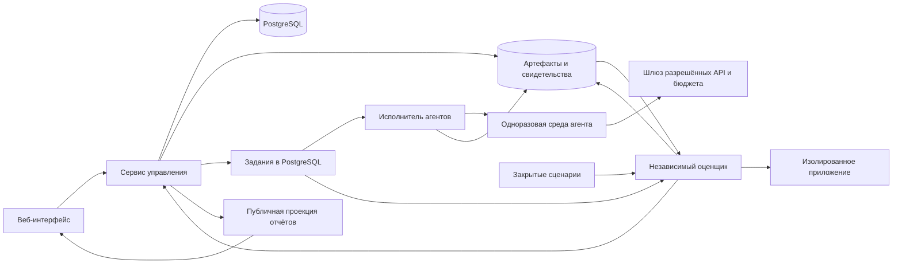

# Архитектура платформы

Статус: предлагаемая архитектура MVP. Конкретные версии зависимостей и поставщик изоляции выбираются при реализации; совместимость ещё не проверена прототипом.

## 1. Развёртываемые компоненты

Один модульный сервис управления, отдельный исполнитель и отдельный оценщик. Разделение нужно прежде всего из-за разных прав доступа и выполнения чужого кода.



Исполнитель и оценщик получают задания через внутренний API с разными сервисными удостоверениями. Прямой доступ рабочих сред к БД отсутствует; стрелки от очереди обозначают логическую доставку. Объектное хранилище разделено политиками доступа: входные артефакты, закрытые сценарии, закрытые свидетельства, очищенные публичные материалы.

## 2. Предлагаемый стек и границы модулей

| Область | Базовое решение | Причина и граница |
|---|---|---|
| Сервис управления | Go, HTTP API, явные транзакции | Один язык для API и оркестрации; это предложение, не требование исходного исследования |
| Интерфейс | TypeScript + React | Кабинет и таблицы приёмки; отдельный backend рендеринга пока не нужен |
| Данные и очередь | PostgreSQL | Общая транзакция изменения состояния, резервирования и постановки задания |
| Большие файлы | S3-совместимое объектное хранилище | Отчёты и БД хранят ссылки и хеши, а не видео и архивы |
| Проверки браузера | Playwright в оценщике | Сценарии действий, снимки, записи; функциональные проверки дополняются проверкой состояния |
| Исполнение | Заменяемый адаптер sandbox-провайдера | Одноразовые VM либо эквивалентная граница изоляции для недоверенного кода |
| Агенты | Адаптер runner; Harbor — кандидат для прототипа | Домен платформы не зависит от формата конкретного движка |
| Вход | Внешний OIDC, приглашения в организации | Платформа хранит роли и членство, не реализует собственный сервис паролей |

Redis, Kafka и Kubernetes не являются зависимостями первого среза. Очередь на PostgreSQL — наше решение для небольшого пилота; `SKIP LOCKED` поддерживает пропуск занятых строк при выборке несколькими потребителями, но сам по себе не гарантирует однократное исполнение. [Документация PostgreSQL](https://www.postgresql.org/docs/current/sql-select.html).

Модули внутри сервиса: `identity`, `campaigns`, `missions`, `entries`, `execution`, `artifacts`, `evaluation`, `acceptance`, `publication`. Модуль владеет своими записями; переходы нескольких модулей выполняет прикладной сценарий в одной транзакции. Полное event sourcing не требуется: текущее состояние хранится в таблицах, изменения — в журнале аудита.

Предлагаемая структура будущего кода, ещё не созданная:

```text
cmd/api/                    HTTP, фоновые диспетчеры и сверка состояний
cmd/runner/                 запуск агентов через sandbox-адаптер
internal/<module>/          доменные правила и прикладные сценарии
internal/platform/          БД, хранение, авторизация, журналирование
web/                        интерфейс
workers/evaluator/          независимые браузерные и API-проверки
contracts/                  OpenAPI и версионированные схемы пакетов
migrations/                 миграции БД
fixtures/city/              публичные данные и эталонные приложения
docs/                       проектные решения
```

Закрытые сценарии реальной кампании хранятся отдельно от репозитория, доступного участникам. Публичные демонстрационные сценарии можно версионировать в `fixtures`.

## 3. Два контура доверия

**Управление** хранит контракты, решения и лимиты. **Исполнение** работает с недоверенным агентом или приложением. Ни архив участника, ни Dockerfile, ни README не считаются инструкцией для управляющего сервиса.

Сборка тоже выполняется в одноразовой среде: до исполнения ограничиваются размер архива и распаковки, количество файлов, выход путей за рабочий каталог и ссылки наружу. Не предоставляются сокет Docker хоста, metadata endpoint облака, внутренние сети и учётные данные платформы. Сеть по умолчанию закрыта; разрешены заданные прокси интеграции и пакетов. Зависимости и образ сохраняются по digest.

Секреты выдаются по `attempt_id`, с коротким сроком, ограничениями сервиса и обязательным отзывом при остановке. Шлюз не записывает ключи в логи. Исполнитель имеет право загрузить результат только своей попытки; оценщик читает закреплённый артефакт и сценарии конкретной оценки. Приложение получает тестовые входы через интерфейс/API, но не файлы валидатора или учётные данные оценщика.

Для демо используется отдельный регистрируемый домен без общих cookies с платформой, отдельное тестовое состояние на сессию и запрет доступа к внутренним адресам. Браузер оценщика также изолирован от управляющей сети. Необработанные HTML-логи не вставляются в интерфейс платформы.

Контейнер не принимается как единственное основание безопасности при исполнении неизвестных участников. Документация Playwright отдельно предупреждает об использовании своего Docker-образа для недоверенных сайтов; архитектура требует изолировать весь процесс браузера. [Документация Playwright](https://playwright.dev/docs/docker).

## 4. Задания, попытки и восстановление

`Run` — намерение выполнить работу по конкретному контракту. `RunAttempt` — одна попытка исполнения. Повтор доставки задания возобновляет работу с существующей попыткой; новая попытка появляется только по явному правилу повторов и с новым резервом.

1. API проверяет членство, контракт, дедлайн и `Idempotency-Key`. В транзакции блокирует строку бюджета, резервирует верхнюю границу затрат, создаёт `Run`, первую попытку, задание и событие аудита.
2. Диспетчер выдаёт lease на задание. Сохраняются `lease_owner`, `lease_until` и возрастающий fencing token. Просроченный исполнитель не может записать итог поверх нового владельца.
3. Перед запуском сохраняется стабильный `execution_key = attempt_id`. Адаптер обязан поддерживать создание или поиск ресурса по этому ключу. Вызов создания возвращает уже существующую среду при повторе.
4. Исполнитель обновляет heartbeat и отправляет измерения с уникальным идентификатором. Запись финального события также идемпотентна.
5. При потере lease управляющий процесс выясняет состояние среды. Пока неизвестно, продолжает ли она расходовать деньги, резерв остаётся занят; новая платная среда автоматически не создаётся.
6. Результат и фактические затраты сверяются; неиспользованный резерв освобождается только после подтверждённой остановки и завершения учёта.

Если провайдер не поддерживает ни идемпотентное создание, ни поиск, автоматическое восстановление запуска после неопределённого ответа запрещено: состояние `reconciliation_required`, ручная сверка. Обещания «ровно одно исполнение» между БД и внешним сервисом нет.

`cancel` переводит попытку в `stopping`; `cancelled` появляется после подтверждения остановки. Отключаются сетевые разрешения и ключи. Если остановку нельзя подтвердить, попытка остаётся видимой в сверке, резерв не высвобождается. Сверяющий процесс ищет потерянные среды по `attempt_id` и сроку жизни независимо от worker.

Обычная ошибка продукта не запускает бесконечный retry. Для пилота допустим один повтор подтверждённого инфраструктурного сбоя, если хватает отдельного резерва; превышение требует остановки этапа и решения организатора по опубликованным правилам.

## 5. Бюджет

Деньги хранятся целым числом минимальных единиц заданной валюты; для токенов и дробных расходов используется фиксированная более мелкая единица учёта. Float не применяется. В рамках одного бюджета нет неявного пересчёта валют.

```text
доступно = лимит − подтверждённые расходы − открытые резервы
разрешить запуск, если доступно >= максимальный резерв попытки
```

Отдельные статьи: работа агента, сборка и размещение, оценка, пользовательские сессии, человеческая подготовка, инфраструктурные повторы. Даже проверка внешней сдачи требует резерва оценки.

Расходы, пришедшие с задержкой, не исчезают после остановки. Для управляемого режима заранее ограничиваются максимальные токены/стоимость каждого обращения, число запросов, время и размер среды. Новый запрос разрешается лишь при достаточном остатке на его верхнюю оценку. Если поставщик не позволяет определить верхнюю границу, показывается мягкий лимит и резерв риска; такой режим не объявляется строго ограниченным по стоимости.

У каждого измерения есть `coverage = complete | partial | unknown` и источник `measured | declared | estimated`. Самостоятельный запуск участника обычно имеет `partial` либо `unknown`. Неизвестные затраты не выигрывают сравнение как нулевые.

## 6. Независимая оценка и воспроизведение

Перед оценкой фиксируются digest артефакта и образа, версия контракта, пакет сценариев, snapshot данных, seed и версия оценщика. Участник не может обновить пакет по той же ссылке. Внутренний URL скачивания краткоживущий, идентичность задаётся хешем и сохранёнными байтами.

Оценщик запускает свежую копию приложения, подготавливает известные данные, выполняет сценарии и сохраняет результаты. Для проверки миграции восстанавливается состояние предыдущего выпуска и применяется новая версия. Проверка пустой БД не доказывает сохранность пользовательских данных.

Результат `error` означает, что проверка не состоялась; `fail` — наблюдаемое нарушение требования при исправной проверке. Неоднозначность направляется арбитру. Отчёт включает также пропущенные и ошибочные проверки. LLM может предложить объяснение, но не является источником окончательного pass/fail спорной функциональности.

Фиксируются две разные возможности: повторно проверить сохранённый артефакт и повторно выполнить генерацию агентом. Первая обязательна для MVP; вторая может не дать идентичного кода и оценивается как отдельная попытка. Испытания живого API не смешиваются с испытаниями snapshot.

## 7. Доступ, публикация и хранение

Каждый частный объект принадлежит организации. Авторизация проверяется по цепочке `organization → campaign → entry/project → object`, включая загрузки, экспорт и события SSE. Участник видит только свои закрытые результаты; организатор — кампанию в пределах роли; публичный API читает отдельную очищенную проекцию.

RLS PostgreSQL предлагается как дополнительный барьер, а не замена проверке роли. При реализации приложение использует роль без обхода RLS и без владения таблицами; административные миграции отделены. Особенности владельца таблиц и `FORCE ROW LEVEL SECURITY` описаны в [документации PostgreSQL](https://www.postgresql.org/docs/current/ddl-rowsecurity.html).

Публикация создаёт снимок разрешённых полей с автором и датой. Закрытые сценарии, логи с секретами, внутренние ссылки и индивидуальные данные тестировщиков исключаются. История исправлений отчёта остаётся видимой. Отзыв материала по подтверждённой утечке оставляет объясняющую запись, а не переписывает конкурсный исход.

Предлагаемая политика пилота: демо доступны 14 дней после завершения; исходные диагностические логи — 30 дней; артефакты и очищенные свидетельства — 90 дней; итоговые решения и хеши — 12 месяцев. Сроки согласуются до открытия кампании. После удаления артефактов отчёт явно теряет статус воспроизводимого; перед удалением доступен экспорт. Юридические сроки и права использования требуют отдельного согласования владельцем проекта.

## 8. Эксплуатация

На старте: один API, отдельные workers исполнения и оценки, PostgreSQL с резервным копированием и объектное хранилище. Недоверенная вычислительная среда находится вне узла API/БД. Compose подходит для разработки с доверенными fixtures; реальных участников туда не запускают без принятой модели изоляции.

Наблюдаемость строится вокруг `campaign_id`, `run_id`, `attempt_id`, `evaluation_id`. Нужны метрики возраста очереди, потерянных lease, активных сред после дедлайна, резервов, затрат, ошибок платформы и времени приёмки. Алерты о потерянной среде и превышении бюджета требуют действия оператора.

До пилота проверяется восстановление БД и артефактов из резервной копии. Цели пилота: потеря не более суток метаданных при аварии и восстановление за рабочий день; это цели, а не обещанный SLA. При незавершённой сверке после восстановления новые платные запуски приостанавливаются.

Harbor оценивается отдельным прототипом по четырём условиям: точная идентичность артефакта, отмена, наблюдаемые затраты и разделение закрытых сценариев. Наличие движка не снимает эти требования. [Официальная документация Harbor](https://docs.harborframework.com/).
