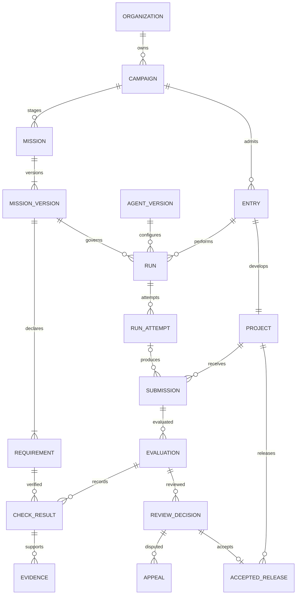
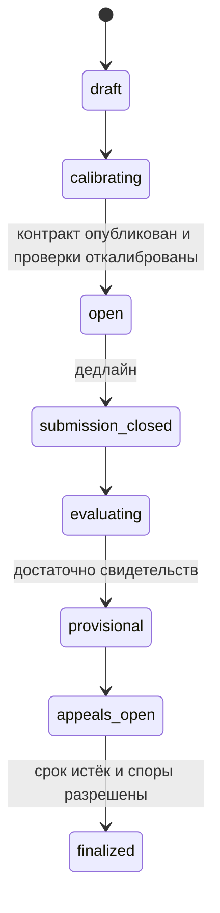

# Модель данных и API

Логическая спецификация v0.1. Это контракт для следующего этапа реализации, не готовая SQL-схема или исполняемый OpenAPI.

## 1. Связи



У каждого участника свой `Project`: конкуренты не пишут в общую историю выпусков. Для парного сравнения нескольких версий конфигурации команда регистрирует отдельные `Entry`, объединённые `comparison_group_id`.

## 2. Сущности

| Сущность | Основные поля | Правило |
|---|---|---|
| `Organization`, `Membership` | id, user_id, role, status | Граница частных данных и полномочий |
| `Campaign` | organization_id, mode, publication_policy, currency, budget_id, state | `mode = public_season / private_trial`; изменение публичности не действует задним числом |
| `Mission` | campaign_id, stage, ordinal, state, active_version_id | Один этап: qualification, build, adapt, handoff |
| `MissionVersion` | mission_id, number, parent_version_id, contract_digest, published_at, deadlines, policies | Полный снимок требований, правил ресурсов и приёмки; опубликованная версия неизменяема |
| `Requirement` | mission_version_id, stable_key, revision, gate, weight, category, text | `stable_key` связывает одно обязательство между версиями; вес и текст принадлежат конкретной версии |
| `ScenarioBundle` | digest, evaluator_digest, dataset_digest, visibility, calibration_id | Код, данные и seeds доступны только оценщику; публичны критерии и примеры |
| `RequirementScenario` | requirement_id, scenario_id, aggregation | Явное соответствие требований и сценариев; для обязательных требований пилота используется `all` |
| `AgentVersion` | organization_id, manifest_digest, model_ids, tools, context_digest, human_policy | Секреты представлены ссылками; смена модели/контекста/инструментов создаёт новую версию |
| `Entry` | campaign_id, team_id, project_id, mode, qualification_status | Команда, проект и режим участия; версия агента назначается каждому запуску |
| `Project` | entry_id, owner_id, name, maintenance_until | У продукта есть владелец и конечный срок размещения |
| `Run` | entry_id, mission_version_id, agent_version_id, purpose, replicate_index, state | Намерение работы; `purpose = build / adapt / handoff`; внешний артефакт может поступить без Run |
| `RunAttempt` | run_id, attempt_no, execution_key, environment_id, state, retry_reason | Одна платная попытка; доставка сообщения не повышает attempt_no |
| `EnvironmentSnapshot` | image_digest, dataset_digest, resource_limits, network_policy, clock, seed | Среда и границы воспроизводимости |
| `Submission` | project_id, mission_version_id, parent_submission_id, run_attempt_id?, replicate_index, official, artifact_digest, manifest_digest, submitted_at, provenance | Только сохранённые и проверенные по хешу байты; исправление — новая сдача |
| `Artifact` | digest, storage_key, size, media_type, retention_until | Физическая дедупликация не даёт права доступа между организациями |
| `Evaluation` | submission_id, scenario_bundle_digest, environment_id, replicate_index, state, supersedes_id? | Повторная оценка не затирает предыдущую; выбранный официальный набор явный |
| `CheckResult` | evaluation_id, scenario_id, requirement_id, status, observed, failure_origin | `pass / fail / error / skipped`; причина `product / platform / scenario / unknown` |
| `Evidence` | check_result_id, artifact_digest, kind, visibility, redaction_state | trace, screenshot, state snapshot, log, manual observation |
| `UserSession` | entry_id, submission_id, pseudonym, assignment_id, rubric_version, observations, score | Хранит слепое назначение и исходные наблюдения; личные данные отделены |
| `ReviewDecision` | evaluation_id, revision, supersedes_id?, eligibility, acceptance, reasons, actor_id, created_at | Содержит точный набор учтённых результатов и свидетельств; старое решение неизменно |
| `Appeal` | decision_id, requirement_id, evidence_ids, reason, state, resolution_id? | Привязка к замороженному результату, срок подачи и арбитр |
| `AcceptedRelease` | project_id, submission_id, decision_id, previous_release_id?, accepted_at | Ссылка на принятое решение и неизменяемый артефакт |
| `ReleaseEvent` | release_id, kind, reason, decision_id, actor_id, at | Отзыв или замещение выпуска добавляет событие, не удаляет приёмку из истории |
| `Budget`, `Reservation`, `UsageEntry` | scope_id, currency, amount, source, coverage, dedupe_key | Учёт в минимальных единицах; сумма открытых резервов учитывается атомарно |
| `Intervention` | run_attempt_id, actor_id, kind, duration_seconds, reason, evidence_id? | Учитывается помощь человека; отсутствие записи не доказывает автономность внешнего запуска |
| `Job`, `AuditEvent`, `IdempotencyRecord` | aggregate_id, version, key, payload_digest, timestamp | Доставка, трассировка изменений и защита от повторных команд |
| `ReportRevision` | campaign_id, decision_ids, rubric_digest, publication_snapshot, supersedes_id? | Итог воспроизводится из зафиксированных решений; публикация и исправление имеют историю |

Все таблицы частных данных включают `organization_id`. Внешние ключи и уникальные ограничения включают tenant там, где возможны перекрёстные ссылки; одной фильтрации списков недостаточно. Пользователь передаёт идентификаторы, но организацию сервер выводит из авторизованного контекста.

## 3. Инварианты хранения

1. Уникальны `(mission_id, number)`, `(mission_version_id, stable_key)`, `(run_id, attempt_no)`, `execution_key`, `(provider, external_usage_id)` и `(organization_id, actor_id, endpoint, idempotency_key)`.
2. `parent_submission_id` и `previous_release_id` принадлежат тому же проекту. Для адаптации обязательна конкретная родительская сдача и идентификатор цепочки повторения; нельзя случайно сравнить адаптацию с чужой исходной версией.
3. `Submission` не может ссылаться на незавершённую загрузку. После фиксации её артефакт, контракт и происхождение нельзя менять. Удалённый по сроку хранения файл остаётся обозначенным как недоступный.
4. `ReviewDecision` не может принять выпуск при `fail`, `error`, `skipped` или отсутствии результата обязательного сценария. Формальное признание сценария невалидным запускает общую процедуру пересмотра, а не персональный пропуск проверки.
5. `AcceptedRelease` создаётся одной транзакцией с окончательной приёмкой; только для завершённого окна споров или явного отсутствия поданных споров после дедлайна. Ссылка на решение совпадает со сдачей выпуска.
6. Все времена хранятся как UTC, отображаются с часовым поясом. Дедлайн сдачи проверяет сервер по времени успешной финализации пакета, а не по времени начала загрузки.
7. Переходы состояния проверяют ожидаемую версию записи. Конкурирующие команды с устаревшей версией получают `409`, а не перетирают друг друга.
8. Каждая команда изменения правил, решения, лимита или публикации оставляет актор, причину и прежнюю/новую версии в аудите той же транзакции.
9. Официальная сдача уникальна по `(project_id, mission_version_id, replicate_index)`, включая внешний режим без Run. Диагностические сдачи имеют `official = false` и не заменяют конкурсный результат. Подтверждённый инфраструктурный повтор сохраняет прежнюю запись и отдельно фиксирует заменяющую официальную попытку; переключение ссылки выполняется атомарно с причиной организатора.

## 4. Состояния

### Миссия



Из любого незавершённого состояния возможен переход в `cancelled` или `invalidated` с причиной. `invalidated` означает непригодность задания/проверки, а не поражение участника. Калибровка может вернуться в `draft` до публикации. После публикации текст не редактируется: новый контракт активируется отдельным переходом с объявлением влияния на сроки и участников. Произвольный `PATCH state` не предоставляется.

Сбой платформы фиксируется на попытке или оценке. Миссия может оставаться `evaluating` с блокирующим инцидентом; инцидент имеет ответственного и срок решения. Кампания завершается после обязательных этапов и финализации общего отчёта; победитель может отсутствовать.

### Попытка исполнения

```text
queued → provisioning → running → collecting → succeeded
                         ├→ failed
                         ├→ budget_exhausted
                         ├→ timed_out
любое активное → stopping → cancelled
неопределённое внешнее состояние → reconciliation_required
```

`succeeded` означает завершение работы и получение артефакта, а не прохождение приёмки. Из `reconciliation_required` разрешён только подтверждённый переход к найденному фактическому состоянию; операция имеет запись сверки. `Run` остаётся активным, пока хотя бы одна попытка не сверена; завершается после определения исхода всей разрешённой политики попыток.

Оценка: `queued → running → completed | infra_error | cancelled`. Завершённая оценка может содержать функциональные `fail`. Решение владельца: `pending → provisional → final`; пересмотр создаёт новую ревизию. Спор: `open → reviewing → upheld | rejected | needs_recheck`; `needs_recheck` блокирует окончательную публикацию до новой оценки и решения.

## 5. HTTP API

Префикс `/api/v1`; JSON, непрозрачные строковые ID, UTC timestamps, cursor pagination. Следующие маршруты задают область API; полная схема полей, ошибок и прав появится в OpenAPI при реализации первого среза.

| Метод и маршрут | Назначение | Кто может вызвать |
|---|---|---|
| `POST /campaigns` | Создать кампанию | Владелец/организатор организации |
| `POST /campaigns/{id}/missions` | Создать этап | Организатор |
| `POST /missions/{id}/versions` | Создать полный снимок контракта | Организатор |
| `POST /missions/{id}/open` | Проверить калибровку и опубликовать контракт | Организатор |
| `GET /missions/{id}` | Получить доступную версию требований и правила | Участник, публично — через публичную проекцию |
| `POST /campaigns/{id}/entries` | Зарегистрировать участие и отдельный проект | Приглашённая команда |
| `POST /agent-versions` | Зафиксировать конфигурацию | Участник |
| `POST /uploads` | Получить ограниченный адрес загрузки | Участник, по квоте |
| `POST /uploads/{id}/complete` | Проверить размер и digest загруженных байтов | Владелец загрузки |
| `POST /entries/{id}/submissions` | Зафиксировать сдачу и запланировать оценку | Владелец entry |
| `POST /entries/{id}/runs` | Запросить управляемый запуск | Участник в разрешённом окне или организатор |
| `POST /runs/{id}/cancel` | Запросить подтверждаемую остановку | Владелец run/организатор |
| `GET /runs/{id}` | Получить состояние, затраты и попытки | Владелец run/организатор |
| `GET /submissions/{id}/evaluations` | Матрица приёмки и доступные свидетельства | Владелец сдачи/оценщик/организатор |
| `POST /evaluations/{id}/decisions` | Создать ревизию решения | Назначенный владелец задачи; арбитр — по спору |
| `POST /decisions/{id}/appeals` | Подать спор по требованию | Затронутый участник/владелец |
| `POST /appeals/{id}/resolve` | Мотивированно разрешить спор | Назначенный независимый арбитр |
| `POST /missions/{id}/finalize` | Закрыть окно, проверить споры, закрепить приёмку | Организатор |
| `POST /campaigns/{id}/report-revisions` | Собрать итог по финальным решениям | Организатор |
| `POST /report-revisions/{id}/publish` | Опубликовать очищенный снимок | Организатор по политике кампании |
| `GET /projects/{id}/releases` | История выпусков | Владелец; публично — разрешённая проекция |
| `GET /campaigns/{id}/events` | SSE состояний, без сырых логов | Авторизованный участник в своей области |
| `GET /public/campaigns/{slug}` | Согласованный публичный отчёт | Все |

У сервисных маршрутов `/internal/v1/jobs/claim`, `/attempts/{id}/heartbeat`, `/attempts/{id}/complete`, `/evaluations/{id}/results` отдельная аутентификация. Scope токена ограничивает конкретные attempt/evaluation; fencing token обязателен. Пользовательский токен не вызывает эти методы.

### Пример управляемого запуска

```http
POST /api/v1/entries/entry_01/runs
Idempotency-Key: 340393d4-ec77-4f57-aac4-cf04d5334960
Content-Type: application/json

{
  "mission_version_id": "mv_build_1",
  "agent_version_id": "agent_03",
  "purpose": "build",
  "replicate_index": 1
}
```

```json
{
  "id": "run_01",
  "state": "queued",
  "attempt_id": "attempt_01",
  "budget": {
    "currency": "USD",
    "reserved_minor": 2000,
    "coverage": "complete"
  }
}
```

Лимит в ответе выводится из контракта; клиент не повышает его параметром запроса. Пример резервирует $20 для работы агента; сборка и оценка имеют отдельные резервы. `202` означает принятие задания, а не успешный продукт.

### Идемпотентность и ошибки

Все создающие команды требуют `Idempotency-Key`. Повтор того же запроса возвращает те же status/body/id; тот же ключ с другим телом — `409 idempotency_conflict`. Запись хранится до окончания кампании и окна хранения её решений. Уникальные предметные ограничения сохраняются после истечения записи: для официального прогона уникальна комбинация entry, версия миссии, назначенный номер повторения. Дополнительная попытка создаётся отдельной разрешённой процедурой.

Ошибки: `401 unauthenticated`, `403 forbidden`, `404 not_found` для невидимых чужих ресурсов, `409 state_conflict`, `409 budget_unavailable`, `410 artifact_expired`, `422 invalid_contract`, `429 rate_limited`. Тело включает `code`, безопасное `message`, `request_id` и ошибки полей; без внутренних секретов. Отсутствие бюджета не запускает частично подготовленную платную среду.

## 6. Пакеты обмена

Манифест сдачи содержит `schema_version`, `mission_version_id`, `project_id`, `parent_submission_id`, `replicate_index`, `source_digest`, `image_digest`, `startup_contract`, `migration_contract`, `declared_agent_version`, `provenance` и описание ограничений. Все поля версии контракта валидируются сервером; команды сборки/старта исполняются только в изолированной среде. Признак официального результата назначает сервер по свободному слоту и правилам кампании.

Для пилота `startup_contract`: HTTP на порту 8080, `GET /healthz`, постоянные данные в объявленном volume, одна команда запуска, отдельная команда миграции. Репозиторий и commit сохраняются как происхождение; воспроизводимость опирается на сохранённые байты, а не на доступность удалённого Git.

Пакет свидетельств связывает `requirement_id`, `submission_digest`, `scenario_bundle_digest`, `environment_digest`, seed либо закрытую ссылку, фактическое наблюдение, статус, время и автора ручного решения. Публичный экспорт включает только разрешённые материалы и перечень закрытых/удалённых частей. Цифровая подпись возможна позже; в MVP обязательны хеши и аудит происхождения.

Пакет передачи: замороженные исходники и образ, инструкции запуска, схема данных и миграции, публичные требования и тесты, принятые ограничения, краткая история решений. Скрытые сценарии и личный контекст первоначального автора не передаются. Запросы уточнений фиксируются как вмешательства.
